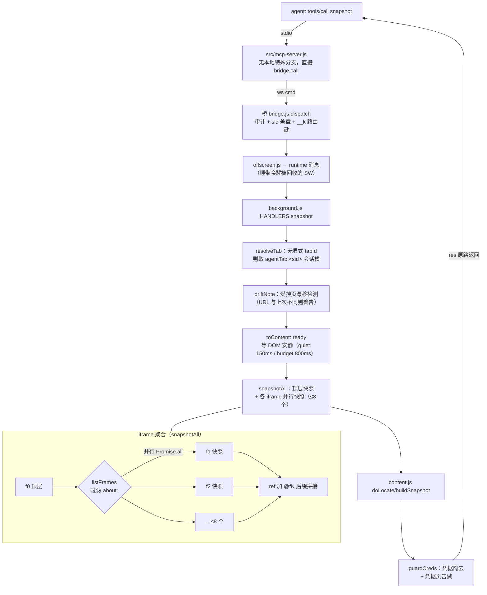

# snapshot 工具技术分析

> 分析日期：2026-09-15 · 版本：v1.2.0
> 代码位置：`extension/content.js`（构建）· `extension/background.js`（编排）· `src/mcp-server.js`（工具定义）
> 格式文档：`docs/快照格式.md`

## 0. 一句话定位

`snapshot` 把当前页面拍成一份**带 ref 编号的可交互元素清单**——每个元素一行，带角色、可访问名和状态后缀，外加页面提示/浮层/正文节选三个附属段，一页通常 1–2k token。它是整个产品的感知基座：后续所有操作（click/type/fill/select/query）都按快照里的编号说话。

设计上的三个「不」——这是它与坐标、CSS selector、整棵 DOM 方案的分界（`extension/content.js:1-9`）：

| 方案 | 为什么不用 |
|---|---|
| 坐标 | 会漂（视口、缩放、布局变化） |
| CSS selector | 改版即崩，且站方从不保证稳定 |
| 整棵 DOM | token 爆炸（一页几十万 token） |
| **ref 编号 + 状态** | 稳定（跨快照认领旧号）、便宜（1–2k token）、可操作（直接回传 ref） |

## 1. 调用链全景



关键路径代码：

- MCP 工具定义：`src/mcp-server.js:50-57`（描述里强调 "Call this before any click/type. Cheap — prefer it over screenshots or eval"）
- background 入口：`extension/background.js:1681-1690`
- content 构建：`extension/content.js:293-376`（buildSnapshot）
- iframe 聚合：`extension/background.js:1035-1063`（snapshotAll）

## 2. 拍摄前：三道准备工序

### 2.1 会话槽解析（resolveTab）

无显式 `tabId` 时取本会话的 `agentTab:<sid>` 槽；页面有主（其他会话占用）会被当场拦下（`extension/background.js:511` 起）。

### 2.2 漂移检测（driftNote）

受控页可能在 agent 不知情时被用户/站点导航走。URL 与该会话上次见到的不一致时，在返回最前面显著说明「这不是你以为的那一页」——不阻断但绝不静默（`extension/background.js:1240-1290`）。历史事故：agent 以为在 npm access 页，实际已跳到 2FA 页。

### 2.3 DOM 安静窗口（ready 命令）

快照前先等页面安静一小会儿（`quiet: 150, budget: 800`），取代「拍完发现是骨架屏、agent 只好把 snapshot 当轮询用」的老问题（审计里同一 tab 连拍两次 588 回，`extension/background.js:1683-1686`）。

安静判定在 content 侧（`extension/content.js:1598-1634`）：

- MutationObserver 监听全树 childList，**只有单次回调累计新增 ≥5 个节点才算「还在渲染」**——时钟、弹幕这类每几十毫秒追加一两个节点的自娱自乐不重置计时器（旧版「完全静默」判定把靶场用例从 1.8s 拖到 10.5s）
- 连续 `quiet` 毫秒无成规模增长 → ready；硬上限 `budget` 兜底（直播页永远等不到绝对静默）

## 3. 候选收集：一阶段（collectCandidates）

遍历方式：`document.querySelectorAll('*')` 全量走一遍，**同时递归 open shadow root**（`el.shadowRoot` 就 walk 进去）——现在大量站点把控件塞在 shadow DOM 里，不递归就等于不存在（`extension/content.js:243-267`）。

### 3.1 可交互判定（isInteractive，6 级判据）

```
① 语义标签：A（须有 href）/ BUTTON / INPUT（除 hidden）/ SELECT / TEXTAREA / SUMMARY
② ARIA role：button/link/checkbox/radio/tab/menuitem/combobox/textbox/switch/option/searchbox…
③ contenteditable
④ 有 onclick 属性
⑤ tabindex ≥ 0
⑥ 兜底：computedStyle.cursor === 'pointer' 且有文字 ——「div 按钮」唯一稳定的破绽
   （现代前端无语义标签、事件用 addEventListener 绑，①-⑤全抓不到。
    小红书发布页第一次快照只抓到 2 个元素，就是漏在这里 → content.js:56-59）
```

每个候选带两个标记（`extension/content.js:252-263`）：

- `semantic`：有语义证据（标签/role/contenteditable）
- `weak`：**只靠 cursor:pointer 进来的**弱候选——区分它很重要：弱候选可以放心去重丢掉，而带 onclick/tabindex 的元素即使嵌在链接里也可能是独立操作（卡片上的「×」关闭钮）

### 3.2 可见性判定（isVisible）

`visibility:hidden` / `display:none` / `opacity < 0.02` / 渲染盒 < 2px 任一命中即不可见（`extension/content.js:29-37`）。视口判定是**窗口不是视口**：`offWindow = 底部 < -2×视口高 或 顶部 > 3×视口高`——视口外但滚得到的算可见（列表页大量元素在下面），太远的丢掉但**计数上报**（`offWindow`，进快照头部的「视口外还有 N 个」提示）。

**disabled 的元素照收**，在 state 里标 `disabled`——「没有提交按钮」和「提交按钮被禁用」是两件事，后者是表单校验没过最常见信号；点它会在 resolve 被 NOT_INTERACTABLE 拦下，那句话比「找不到」有信息量（`extension/content.js:40-43`）。

### 3.3 护栏

候选上限 400（`cands.truncated = true`）；输出行上限 300；无名 button 收录上限 40。

## 4. 二阶段去重：消灭「同一可点区域算两次」

重复不只是费 token——它给了 agent 一个**点了不管用的选项**（`extension/content.js:269-287`）：

| 去重规则 | 场景 |
|---|---|
| `<label>` 是另一控件的代言人，本尊在候选里 → 丢 label | 免得 agent 在「点 label」和「点输入框」之间犹豫 |
| 弱候选被别的候选包含 → 丢弱候选 | `<button>` 里的 `<i>` 图标 |
| 候选内部还裹着别的候选 → 外层让位 | 小红书侧边导航整块 pointer，不滤会冒出把所有子项文本拼一起的假按钮——点不中，还白占 token |

判定全用 DOM 包含关系（`contains`），`has()` 是 O(n²) 但 n ≤ 400 可接受。

## 5. 编号稳定性：跨快照认领旧号

这是快照机制里最精巧的一段（`extension/content.js:293-343`）：

**问题**：原先每次从 e1 重数，agent 上一轮建立的认知（「提交按钮是 e12」）下次 snapshot 立刻作废；页面上插入一个元素，后面所有编号整体偏移——「变了什么」根本没法回答。而实测同一页面连续两次快照，DOM 节点 **100% 是同一个对象**（GitHub 仓库页 164 个元素一个都没换）——编号会变纯粹是自己重新数了一遍。

**机制**：

1. 拍摄前把旧 `refMap` 里仍连接在 DOM 上的元素收进 `prevRef: Map<el, ref>`
2. 新快照先给每个元素**认领旧号**（`prevRef.get(el)`），认领到的进 `taken` 集合
3. 剩下的元素从 e1 开始找**空号**（`do { next++ } while (taken.has('e'+next))`）——新元素永远抢不走老元素的号，agent 手里的 ref 不会悄悄指向别的东西

**配套防呆——语义漂移比对**（`extension/content.js:649-662`，resolve 时执行）：编号稳定后多了一种新的危险——元素还在原地但承载的东西换了（列表刷新时框架复用同一批 DOM 节点，`[e5]` 的「删除」转眼是另一条记录的删除按钮）。所以 `refMap` 记录当时的 `{el, role, name}`，操作时重算 `accessibleName` 比对，对不上抛 `STALE_SNAPSHOT`，错误消息同时印出「现在是 X，不再是你看到的 Y」。

## 6. 命名：15 级候选链 + 就近兜底

`accessibleName`（`extension/content.js:65-98`）按优先级依次尝试，取第一个非空：

```
aria-label → aria-labelledby（byId 反查）→ label[for=id] → closest('label')
→ placeholder → data-placeholder / aria-placeholder / dataset.placeholder
  （contenteditable 没有原生 placeholder，各家自造属性配 ::before 显示——
    不查这几个，富文本编辑器就是一排没名字的 textbox）
→ title → alt → 子 img[alt] → 子 svg>title（图标按钮的名字常常只写在这里）
→ input[submit/button/reset].value →（select 排除：innerText 是全部选项拼起来的长串）
→ innerText → aria-describedby 反查（react-select 把占位符放单独 div 里靠它指过去）
→ name 属性
```

全部落空才走 `nearbyLabel`（`extension/content.js:110-131`）——**只给表单控件兜底**（链接/按钮的名字本该来自自身文字，从旁边捡标签只会造出误导假信息），向上最多爬 7 层父节点找 `label, legend, .form-label, [class*="label"], [id$="-label"]`（react-select 会把真 input 埋六七层 div 底下），标签文字 ≤40 字才采用。

名字统一截断到 60 字。

## 7. 角色推断（roleOf）

显式 `role` 属性优先；否则按标签映射（A→link、BUTTON/SUMMARY→button、SELECT→combobox、TEXTAREA→textbox…，`extension/content.js:133-155`）。两个有意设计：

- **file input 单列为 `file` 角色**——标成 textbox 是静默陷阱：agent 看见 textbox 就去 type，往 file input 写字符串什么都不发生（浏览器不允许），它还以为填上了。单列后由 state 后缀直接指路「用 upload 工具，不能 type」
- 无语义元素（div 按钮）默认落 `button`

## 8. 状态后缀（stateOf）：让 agent 一眼看出「现在是什么」

`extension/content.js:184-230`，按角色出牌：

| 角色 | 后缀内容 |
|---|---|
| checkbox/radio/switch 等 | `checked` / `unchecked`（`el.checked ?? aria-checked`） |
| file | `已选 <文件名>` / `empty`、`accept: …`、`用 upload 工具，不能 type` |
| textbox/searchbox | `value: "…"`（普通 40 字 / 富文本 200 字截断）、`type: date/number/…`、`required`、`empty` |
| **密码框** | **只报位数** `value: <15 位>`——位数仍有用（判断「填没填进去」），值不回显。协议文档一直写着不回显，代码里曾回显过——快照是 agent 每一步都读的东西，泄露面比效果证据还大（`content.js:203-207`） |
| combobox（原生 SELECT） | `selected: "当前项"` + 前 8 个选项预览 `options: A \| B \| …`（agent 常常连点开都不用） |
| 通用 | `expanded:`（aria-expanded）、`selected/pressed/current`（aria-selected 等）、`class: is-checked`（状态词 class）、`disabled` |

`stateClass` 只认「状态词在 token 末尾」的 class（`(?:^|[-_])(checked|selected|active|open|current|pressed|on|off|expanded|collapsed)$`）——PrimeNG 的 `ui-state-active`、Element UI 的 `is-checked`、自家的 `.selected`，同时不把 `button`、`onboarding` 里的 on 当状态（`extension/content.js:161-166`）。

## 9. 无名按钮收容（idHint）

无名元素以前直接消失（「多半是装饰性图标」），代价是图标按钮、自定义开关（PrimeNG `<div class="ui-chkbox">`）、卡片上的「×」在快照里不存在，agent 只能写 querySelector 去摸——v0.7 数据里 129 次「看」的 eval 相当一部分是在摸这些。现在给可指到的标识（`#id` → `[data-testid=…]` → `.首个class`），封顶 40 个，超了标记 truncated（`extension/content.js:171-179, 322-331`）。

## 10. 三个附属段 + 正文节选

快照主体（元素行）之外，头部和尾部还有四个信源（`extension/content.js:359-374`）：

### 10.1 页面提示（collectAlerts，放最顶上）

表单流程最主要的失败模式是校验错误，而校验错误最容易被漏看——正文节选只截 1500 字，长页面的红字进不来，agent 以为自己成功了接着走。提示单独收一遍放快照最上面，**宁可多报不漏报**（`extension/content.js:378-387, 476-503`）：

- 判据：`[role=alert]`、`[aria-live]`、`[aria-invalid=true]`（页面明确声明「我是提示」，无条件采信）+ class 名猜测（`.error`、`[class*="toast"]` 等）
- **class 猜中的要过滤**：挂 error class 的推广框、导航里的 label 都会冒充校验错误（实测抓到过把「Playwright tutorials」当提交失败原因）；在 `nav/header/footer/aside` 里的丢掉、整块内容是一个链接的（推广位）丢掉
- 嵌套时取最里层节点（否则整块表单文字当一条提示报出来）

### 10.2 浮层/对话框（collectOverlays）

「页面上盖着一个弹窗」是 agent 最需要第一眼知道的事——不知道就会对着被遮住的按钮反复点。判据比风控采集窄：明确声明的 dialog + class 名自述 modal/popup/drawer/mask/lightbox 的 fixed 浮层；sticky 导航条不算。外层浮层套着真 dialog 时只报里面那个，≤4 条（`extension/content.js:424-446`）。

### 10.3 页面声明的工具（collectDeclaredTools）

WebMCP 声明式表单（Chrome 149 起 origin trial）：`<form toolname tooldescription>` + `<input toolparamdescription>`——站方自己把「这表单干什么、每个字段填什么」写在 DOM 上，是「NETWORK for DATA」哲学的官方化。只发现不新造命令：填还是 fill、提交还是 click，走既有敏感闸（`extension/content.js:454-474`）。

### 10.4 正文节选（mainText，尾部）

`article/main/[role=main]/#js_content/.article-content` 优先，否则 body；克隆后剥 `script/style/nav/header/footer/aside/svg/iframe/[aria-hidden]`；**form 不剥**（剥了表单页的字段标签、校验文案全丢，而表单向导正需要「读一眼再决定」）；清零宽字符（国内站点遍地都是，防复制用，不清会变成一行行看不见的「文字」白付 token）；截 1500 字（`extension/content.js:359, 507-519`）。

## 11. iframe 聚合（snapshotAll）：跨源也有效

`extension/background.js:1034-1063`：

1. `listFrames` 用 `executeScript(allFrames)` 枚举全部框架（过滤 `about:`），拿 frameId+url
2. 顶层先拍；子框架**并行拍**（`Promise.all` 保序——串行时每个框架付一次完整往返，带广告的页面动辄七八个 iframe，一次快照变八次的时间）；上限 8 个（广告位常有十几个 iframe，全抓撑爆快照）
3. 子框架快照的 ref **正则替换加 `@fN` 后缀**：`[e5]` → `[e5@f2]`；剥掉各自的正文节选段只留元素行
4. 注入失败的框架（sandbox/已跳走）留一行说明而非静默消失
5. 各框架自己的 snapshotId 记入 `storage.session`（`frames:<tabId>`）——**放内存的话 SW 一被回收，iframe ref 必然报 STALE_SNAPSHOT，而 agent 明明刚拍完什么都没做**

**协议对 agent 完全不变**：`e5@f2` 原样回传，桥接层 `splitRef` 拆出 frameId 路由到那个框架并还原成 e5（`extension/background.js:863-882`）；`routeOf` 强制一条命令的所有 ref 落在同一框架（跨框架的一次操作没有意义，明确拒绝）；回执里把 `@fN` 补回去，否则「已点击 [e1]」看着像点到了顶层框架的另一个元素。content script **完全不知道有框架这回事**，click/type/fill 一行都不用改。

## 12. 输出格式与 token 经济

```
# 淘宝网 — https://www.taobao.com
[snapshot s2] 38 个可交互元素

[e1]  link      "首页"
[e2]  searchbox "搜索商品" (empty)
[e3]  button    "搜索"
[e4]  checkbox  "包邮" (unchecked)

--- 正文节选（完整正文用 read_text）---
…
```

- 角色列 `padEnd(9)` 对齐，人读 agent 读两便
- 头部带截断提示（「已截断：元素太多…先滚动到那里再拍」）和 offWindow 计数（「视口上下几屏之外还有 N 个」）——**截断必自报**，不装完整
- 返回体 `{untrusted: true, meta: 'url=… snapshot=sN', snapshotId, alerts, text}`——`untrusted` 让 MCP 侧裹 `<page-content untrusted>` 边界（prompt injection 降权）
- agent 回传操作时带 `snapshotId`，content 侧校验「这份快照还是最新的吗」

## 13. ref 的消费端：resolve 五道闸 + find 语义定位

快照的价值在消费端兑现。`resolve`（`extension/content.js:623-666`）按序过闸：

1. `find` 走语义定位，不受快照约束（批处理中间页面变了还能用）
2. **ref 与 selector 互斥**：同时给直接抛错——selector 生效而回执印的是 ref，「点错了从返回里完全看不出来」（开发中真撞过：传 `{selector:"button", ref:"e26"}`，点掉了页面顶部通知关闭钮，回执却说点了提交按钮）
3. selector 兜底通道：snapshot 抓不到时（渲染尺寸 0、异形编辑器、shadow 边界）的退路，代价是失去 ref 防呆
4. 快照校验：`snapshotId` 不匹配 → `STALE_SNAPSHOT`；元素已移除 → `REF_NOT_FOUND`
5. **语义比对**：`accessibleName(el) !== rec.name` → `STALE_SNAPSHOT`（防 DOM 节点复用，见 §5）；不可见/disabled → `NOT_INTERACTABLE`（disabled 的错误消息直接指路「多半是表单没填完整，看快照里的页面提示」）

`findEl`（`extension/content.js:572-621`）是快照之外的语义定位：**复用 collectCandidates 同一套判据**（两边各写一份会出现「快照里看得到、find 找不到」，且极难排查）；三级匹配先严后宽、**任一级有结果就停**（混排的话包含匹配可能排在精确匹配前面——「确定」和「确定删除」是两个按钮）；命中多个**报错不猜**（「删除」和「删除全部」常并排放着），用 `nth` 指定；找不到时列出页面上前 12 个候选名，省一轮盲目重试。

## 14. 快照后的最后一道闸：guardCreds

快照文本回 agent 前过 `guardCreds`（`extension/background.js:1217-1238`）：

- `redactCreds` 把**成组出现**（≥3 行，中间夹空行不断组）的高熵行替换成 `[已隐去 N 行疑似凭据]`——单个长串常是正常 ID/hash，全隐去会把快照变噪声；恢复码和密钥列表天然成组（`extension/redact.js:75-97`）
- URL 命中凭据页正则（`/tfa|2fa|recovery|tokens|api-keys|password…`）时额外加一行告诫「这类内容不要转述、不要写进文件」——隐去而不是拒绝，agent 有时确实要在 tokens 页上点按钮

## 15. 边界与已知限制

| 限制 | 表现 | 出处 |
|---|---|---|
| 浏览器保护页 | `chrome://`、应用商店等注入不了，快照直接 NOT_INTERACTABLE | background.js:944-945, 809-816 |
| sandbox iframe | 注入失败，快照里留「注入不了」一行说明 | background.js:1051-1053 |
| closed shadow root | `el.shadowRoot` 为 null，递归不进去（浏览器边界） | content.js:245 |
| 极端长页 | 候选 400 / 行 300 / 无名 40 三级截断，截断必自报 | content.js:264, 329, 335 |
| 视口远处 | offWindow 丢弃但计数上报，提示「scroll 过去再拍」 | content.js:38, 249, 365 |
| cursor:pointer 误报 | 理论上带文字的 pointer 元素都可能进来；靠弱候选去重兜底 | content.js:59, 281 |
| 密码框 | 值只报位数——「填没填」可判断，「填的什么」不可见 | content.js:207 |
| 后台标签页 | 快照本身正常（DOM 在），但视觉/渲染相关操作受限 | README |
| 框架混合 | 一条命令的 ref 必须同框架，跨框架明确拒绝 | background.js:871-875 |

## 16. 设计上的「一招三用」

快照的候选收集函数 `collectCandidates` 被**三个消费方共用**，这是整个机制里最值得借鉴的工程决策（`extension/content.js:234-236`）：

1. `buildSnapshot`——拍快照
2. `findEl`——语义定位（find 参数）
3. `baselineOf`/`targetState`——效果证据的基线采集

判据同源意味着「快照里看得到」⇔「find 找得到」⇔「效果核对看得懂」，任何一处升级（比如明天学会一种新的 div 按钮识别法）三方同时受益，不会出现 agent 照着快照写名字却找不到的分裂。

## 17. 小结：snapshot 的技术要点清单

| 要点 | 机制 | 一句话理由 |
|---|---|---|
| 编号稳定 | prevRef 认领 + taken 集合 | agent 的认知跨快照保值 |
| 语义防漂 | refMap 记 name，操作时比对 | DOM 节点复用是新危险 |
| 命名 15 级链 | aria→label→placeholder→text→describedby | 现代 UI 的名字藏在各处 |
| div 按钮兜底 | cursor:pointer + 文字 | 无语义标签时代的现实 |
| disabled 照收 | state 标记不丢弃 | 「被禁用」是校验信号 |
| 去重 | 包含关系三级滤 | 不给 agent 点了不管用的选项 |
| 提示置顶 | 声明优先、猜测过滤 | 校验错误是表单第一大死因 |
| iframe 并行 | @fN 后缀、协议不变 | 支付/验证码都在 iframe 里 |
| 安静窗口 | MutationObserver ≥5 节点 | 骨架屏 vs 弹幕的规模差 |
| 出门脱敏 | 成组凭据隐去 + 凭据页告诫 | 2FA 恢复码事故的防线 |
| 截断自报 | 三级上限 + offWindow 计数 | 不装完整，教 agent 下一步 |
