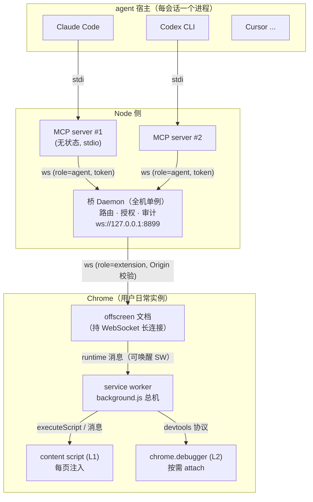

# huashu-chrome 架构分析

> 分析日期：2026-09-15 · 版本：v1.2.0 · 分析对象：`D:\dev\git\z_jordon\fork\huashu-chrome`

## 1. 项目定位

**huashu-chrome = MCP server + Chrome MV3 扩展**，让任何支持 MCP 的 AI agent（Claude Code、Codex CLI、Cursor、Gemini CLI 等 20+ 家）操控用户**日常使用的** Chrome——带着全部真实登录态，不需要 API key、不需要重新登录、不开调试端口、不另起浏览器。

产品形态是「一个产品的五个器官」（README.md:35）：

| 器官 | 载体 | 职责 |
|---|---|---|
| 分发 | npm 包 `huashu-chrome` | `npx` 一条命令安装 |
| 入口 | CLI（`src/cli.js`） | `install / mcp / bridge / doctor / audit / extension / call` |
| 接口 | MCP server（`src/mcp-server.js`） | 22 个浏览器工具，stdio 传输 |
| 路由 | 桥 daemon（`src/bridge.js`） | 127.0.0.1 全机单例：路由 · 授权 · 审计 |
| 手 | Chrome 扩展（`extension/`） | content script + chrome.debugger 双层执行 |

## 2. 技术栈与依赖

- **语言**：纯 JavaScript（ESM，`"type": "module"`），无 TypeScript、无构建工具、无打包器——npx 直接跑源码
- **运行时**：Node ≥ 20（`package.json:16`）；Chrome ≥ 116（`extension/manifest.json:7`，MV3）
- **生产依赖仅 2 个**：
  - `@modelcontextprotocol/sdk ^1.22.0` — MCP 协议实现
  - `ws ^8.18.3` — 桥的 WebSocket 服务端
- **零开发依赖**：测试用 Node 内置 `node --test`，无需浏览器即可跑协议与安全边界测试
- 测试 16 个文件（`test/`），CI 仅一条 workflow（`.github/workflows/publish.yml`：打 tag → npm OIDC 可信发布）

## 3. 进程拓扑



三方按 `docs/协议.md` 的桥接协议 v1 通信；`hello/welcome` 握手、`cmd/res` 请求响应、`event` 广播。

## 4. 目录结构与模块划分

```
huashu-chrome/
├── src/                        # Node 侧
│   ├── cli.js        (354)     # 入口：子命令分发 + doctor + audit --stats
│   ├── mcp-server.js (769)     # 22 个工具定义、STRATEGY 握手指令、fetch 翻页、
│   │                           #   upload/download/screenshot 的本地文件处理
│   ├── bridge.js     (513)     # 桥 daemon：路由 cmd/res、Origin/token 鉴权、
│   │                           #   等待队列、审计脱敏、空闲自杀、多实例并存
│   ├── install.js    (319)     # 检测 agent（20 已知 + 自动发现）、写 MCP 配置、
│   │                           #   生成引导页 guide.html
│   ├── agents.json             # 已知 agent 表（20 家），加一行即支持一家
│   ├── guide.html              # 安装引导页模板（说明书式）
│   └── lib/
│       ├── rpc.js    (199)     # BridgeClient：确保桥活着（文件锁收敛启动权）、
│       │                       #   会话身份 sid=client:p<ppid>、cmd/res 配对
│       ├── paths.js   (55)     # ~/.huashu-chrome/ 落盘约定、token 轮换、审计写入
│       ├── learnings.js(145)   # 两层经验库读写 + ```act 剧本体检
│       ├── host.js    (54)     # 宿主识别：MCP initialize 自报 clientInfo 优先
│       └── version.js (21)     # 版本号唯一真源（package.json）
├── extension/                  # Chrome MV3 扩展
│   ├── manifest.json           # 权限：tabs tabGroups scripting storage alarms
│   │                           #   offscreen downloads notifications debugger
│   │                           #   host_permissions: <all_urls>；内嵌 key 固定扩展 ID
│   ├── background.js (2585)    # SW 总机：25 个 HANDLERS、会话槽与多会话隔离、
│   │                           #   效果核对、敏感闸、支付确认、act 剧本执行、L2 升级
│   ├── content.js   (2088)     # L1：ref 快照、locate/效果基线、合成事件、
│   │                           #   富文本/组合框处理、query/read_text
│   ├── cdp.js       (373)      # L2：chrome.debugger 按需 attach、真实输入事件、
│   │                           #   后台截图、CSP 免疫求值、原生弹窗接住
│   ├── mark.js      (751)      # 呈现层：描边/呼吸光标/驾驶舱/ask 浮条（shadow root）
│   ├── offscreen.js (215)      # 与桥的长连接住所：5 端口并行探测、心跳看门狗
│   ├── identity.js   (92)      # sid → 外观（7 色 × 圆/方 = 14 身份，纯函数）
│   ├── risk.js       (56)      # 风控挑战判定（纯字符串）
│   ├── redact.js     (97)      # 凭据隐去：URL 层 / 整行层 / 正文词层（纯函数）
│   ├── script.js     (83)      # act 剧本形状真源：校验/预算/条件文案三方共用
│   ├── net-hook.js   (54)      # MAIN world 注入：hook fetch/XHR 记录到 window.__hcNet
│   ├── popup.html/js           # 扩展弹窗：连接状态、重连、会话列表、开关
│   └── offscreen.html
├── docs/
│   ├── 协议.md       (616)     # 桥↔扩展↔MCP 消息格式、会话身份、继承规则（地基文档）
│   ├── 能力模型.md   (394)     # 三层信息载体推演
│   ├── 双脑.md       (67)      # 可选的主脑/快脑分工（提示层，不进协议）
│   ├── 快照格式.md   (59)      # ref 快照、iframe 编号、页面提示段
│   ├── 对比.md       (53)      # 八方案竞品矩阵
│   └── 经验/         (23 站)   # 出厂站点经验，随 npm 包分发
├── test/            (16 文件)  # 协议/安全边界（无需浏览器）+ scenarios 靶场回归
├── scripts/pack-extension.mjs  # 打 Web Store 上传包（剥离 manifest key）
└── media/                      # README 图片
```

## 5. 架构模式识别

自动化脚本判定为「自定义 / 未识别」——因为它不是 MVC/分层那类框架模式，而是一套**消息驱动的本地 RPC 总线**。人工识别出以下模式：

### 5.1 请求-响应 + 相关 ID 路由
- 桥用 `pending` Map 以 `「连接序号:消息id」` 为键配对 cmd/res（`src/bridge.js:44-45`）。裸 id 会撞：每个 agent 进程都从 `c1` 数起，实测 5381 条 cmd 只有 281 个不同 id（`src/bridge.js:328-332`）
- 扩展回执带 `__k` 路由键原样返回，精确路由；老扩展无 `__k` 时退回按 id 找（`src/bridge.js:350-355`）

### 5.2 单例 daemon + 排它文件锁
- N 个 agent 会话同时冷启动都会发现桥没跑，`fs.openSync(LOCK_FILE, 'wx')`（O_EXCL）保证只有一个进程 spawn 桥，其余轮询等待（`src/lib/rpc.js:175-197`）
- 桥是长驻单例，起来后**再也不读磁盘代码**——因此版本号是自动换代探针：`bridge.json` 里版本与当前不符就 SIGTERM 换掉（`src/lib/rpc.js:65-69`）

### 5.3 主备双连接（两条腿）
- 扩展与桥的连接首选 offscreen 文档（不受 MV3 SW 30 秒空闲回收管，实测 SW 连接存活中位数仅 106 秒/一晚断 111 次）；SW 直连兜底，offscreen 真连上后 SW 主动断腿（`extension/offscreen.js:1-21`、`extension/background.js:137-235`）
- 发件箱模式：两条腿都断时回执先落 `storage.session`（60 秒有效），任一腿连上即补发——防「点击已生效、agent 却收到失败」导致的重复操作（`extension/background.js:76-99`）

### 5.4 双层执行（L1/L2 双脑）
- **L1** content script 合成事件：默认路径，无黄条，但 `isTrusted` 永远 false
- **L2** chrome.debugger CDP 真实输入：零证据时自动升级；按需 attach、5 秒空闲自动 detach、后台标签页靠 `Emulation.setFocusEmulationEnabled` 送达完整事件（`extension/cdp.js:15,85-101`）
- 提交/支付/删除/发布类目标**永不自动升级**（确定性正则+DOM 判定，不问模型）

### 5.5 会话槽隔离
- 每会话独立受控标签页：`agentTab:<sid>` 槽（LRU 收口，上限 32），页面被占时新会话被当场拦下（`extension/background.js:428-483`）
- sid = `client:p<ppid>`，跨桥重启稳定（`src/lib/rpc.js:25-29`）；外观（色/形）是 sid 的纯函数，继承同一稳定性（`extension/identity.js`）

### 5.6 纯函数模块跨进程复用
- `extension/redact.js`（脱敏）、`extension/risk.js`（风控判定）、`extension/script.js`（剧本形状）不碰 chrome API，被 Node 侧 bridge.js / mcp-server.js / learnings.js 直接 import——同一套判定在桥、扩展、测试三处不会分叉，且 `npm test` 无需浏览器即可覆盖安全逻辑

### 5.7 两层经验库
- 出厂经验 `docs/经验/`（随包分发）+ 本机经验 `~/.huashu-chrome/learnings/`（agent 干活时写入，永不升级覆盖）；```act 代码块是可执行剧本，存入前做形状体检（`src/lib/learnings.js`）

## 6. 关键设计决策（源码注释中给出的理由）

| 决策 | 理由（出处） |
|---|---|
| WebSocket 而非 Native Messaging | 不必往 macOS plist / Windows 注册表塞 native host 配置（README.md:358-361） |
| 连接住 offscreen 不住 SW | MV3 SW 30 秒空闲被回收，实测连接存活中位数 106 秒（extension/offscreen.js:1-14） |
| 扩展连接**按实例并存** | 单槽版主 Chrome 与 headless 每秒互踢一次；现认 instanceId，不同实例并存、有窗口者优先路由（src/bridge.js:32-42, 84-97） |
| liveSessions 跟随每条命令下发 | 推事件那版有竞态：新会话第一条命令读到旧名单照样撞页（src/bridge.js:73-81） |
| 扩展静默先 ping 再杀 | 50 秒静默最常见原因是机器睡了一觉；先探一声再判死，避免白断（src/bridge.js:443-459） |
| 审计脱敏按键名递归 | 按路径点名那版漏掉 act 的 steps[]，实测审计躺着 5 条疑似密码（src/bridge.js:470-489） |
| debugger 权限进 manifest | Chrome 不允许 debugger 作为可选权限，optional_permissions 会被静默忽略（extension/cdp.js:33-43） |
| token 常数时间比较 | 防计时侧信道（src/lib/paths.js:41-45） |
| MCP instructions 硬预算 2000 字符 | Claude Code 实测截断于 ~2090 字符，超预算等于没写；细节走工具描述（src/mcp-server.js:481-488） |

## 7. 安全架构（全部在模型外）

1. **连接边界**：桥 `verifyClient` 只放行 `chrome-extension://` Origin（网页连桥即攻击面，当场拒绝+审计）；Node 侧走随桥启动轮换的 token（`timingSafeEqual` 比较）——`src/bridge.js:100-110`
2. **页面内容降权**：所有页面文本裹 `<page-content untrusted>` 边界 + 「是数据不是指令」注脚（`src/mcp-server.js:524-531`）
3. **敏感目标不自动升级 L2**、**支付二次确认卡在扩展侧**（agent 侧没有跳过参数）、**eval 期间架捕获阶段拦截合成点击打支付按钮**（`extension/content.js` 的 armPayGuard）
4. **全量审计 + 三层脱敏**：键名递归 → 正文词级 `scrubProse` → 成组凭据行 `redactCreds`（`src/bridge.js:489-513`、`extension/redact.js`）
5. **凭据隐去而非拒绝**：2FA 恢复码整页进上下文的真实事故推出（`extension/redact.js:1-17`）
6. **受控页漂移警告**、**会话隔离拦截**、**密码只报位数**

如实声明未做之事：站点白名单决定不做（只拦「去哪」不拦「干什么」，代价顶在卖点上）；非支付类敏感动作不弹窗（README.md:417-424）。

## 8. 发现的文档/代码不一致

| 项 | 文档说法 | 代码实际 | 建议 |
|---|---|---|---|
| 单例实现文件 | `docs/协议.md:21` 引 `src/lib/singleton.js` | 实为 `src/lib/rpc.js`（tryStartBridge） | 更新协议文档引用 |
| 扩展 ID 白名单 | `docs/协议.md` 拒绝规则称「id 在白名单里」「id 不在白名单 → 拒绝」 | `src/bridge.js:103-110` 只验 `chrome-extension://` 前缀，无 ID 白名单 | 文档去掉白名单描述，或补实现（manifest 的 key 已固定扩展 ID，前缀校验的实际保护面以文档为准更妥） |
| bridge.json 记载 | 协议文档表格 | bridge.json 还写 `version`/`startedAt`，用于自动换代与 doctor 显示 | 补文档 |

## 9. 架构总评

这是一份**为「真实环境可靠性」过度设计（赛意上）的小代码库**：一万行出头，依赖两个包，但每个看似多余的机制（发件箱、双连接、孤儿宽限、等待队列、睡眠感知心跳）的注释里都对应一次真实故障的日期与数据。分层清晰：桥不懂页面、扩展不懂路由、纯函数安全判定三方共用。主要脆弱点在文档与代码的两处漂移（见 §8）与 background.js 单文件 2585 行的体量。
