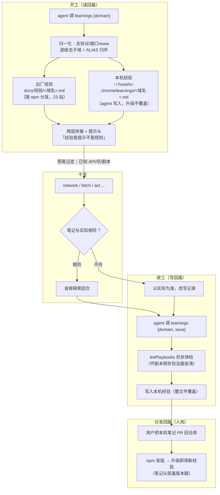

# 经验回流机制分析：「第二次做同样的任务更快」是怎么实现的

> 分析日期：2026-09-15 · 版本：v1.2.0
> 核心代码：`src/lib/learnings.js`（读写）· `src/mcp-server.js`（learnings 工具 + 握手策略）· `docs/经验/`（出厂经验）· `extension/script.js`（剧本校验）

## 0. 效果主张与实证

README 的核心数字（README.md:63、docs/经验/feishu.cn.md:3-4）：

> 同一个飞书多维表格任务，**从零摸索 281 次调用 / 54 分钟**；把摸清的规律记下来之后，**第二次不到 10 次调用**。

第一次的时间去哪了？feishu.cn.md 里逐条记着「学费」：

| 首次摸索烧掉的回合 | 干的事 | 经验记下的结论 |
|---|---|---|
| 40+ 次 eval | 在 DOM 里找表格行 | **网格是 canvas，DOM 里没有行**——找是无用功，直接判死这条路 |
| ~30 轮 | 猜删除接口路径（全 404）、挖 bundle | 逆向未果，正解是飞书 OpenAPI |
| 1 次事故 | JS 直写 value + dispatch input 事件 | React 只认真实输入，直写被**静默丢弃**还留一条残缺记录 |

「第二次更快」的本质：**这三类探索成本被一条 markdown 笔记一次性买断了**。机制要解决的问题是「这笔买断如何发生、如何保值、如何分发」。

## 1. 机制总览



三个回路：**读回路**（开工先查）、**写回路**（收工存回）、**分发回路**（PR → npm 升级）。全部挂在 `learnings` 这一个 MCP 工具上。

## 2. 存储层：两层经验库

`src/lib/learnings.js:1-14`：

| 层 | 位置 | 谁写 | 生命周期 |
|---|---|---|---|
| 出厂经验 | npm 包内 `docs/经验/<域名>.md` | 维护者（含用户 PR） | 升级即更新，当前 23 站：淘宝、京东、B 站、小红书、飞书、12306、微博、知乎、豆瓣、微信公众号、X、雪球外的脉脉/大麦/即刻/腾讯文档/Ollama、Google 学术、App Store Connect、iCloud 开发者后台、搜狗微信、两个 canvas 游戏样板（sudoku/flappybird） |
| 本机经验 | `~/.huashu-chrome/learnings/<域名>.md`（目录权限 0700） | **agent 干活时自己写** | 永不被升级覆盖；全在本机磁盘，不上传 |

两层是**叠加**不是替换：读取时若有本机经验，以「## 出厂经验（v1.2.0）」「## 本机经验」两节拼在同一份返回里——本机经验排在后面，等于对出厂经验的补充与修正记录。

`docs/经验/` 里那份「chrome.google.com 做不到」的负面笔记（README.md:68）也是设计的一部分：**能干什么和干不了什么同样重要**，一条「这堵墙长什么样、报错认哪一句」的负面结论，省下的是 agent 在墙上撞十几个回合。

## 3. 检索层：domain 怎么落到对的文件上

`src/lib/learnings.js:16-60`，三级处理：

1. **归一化** `normalize()`：`https://my.feishu.cn/base/x?y=1` → `my.feishu.cn`（去协议头、路径、端口、www）
2. **归属解析** `resolveKey()`：逐级去子域找已知键——`my.feishu.cn` → `feishu.cn`（先在两层目录的文件名集合里匹配）
3. **ALIAS 归并**（learnings.js:17-23）：同一个站的多个门牌号归到一个键——`tmall.com→taobao.com`、`twitter.com→x.com`、`larksuite.com→feishu.cn`、`qpic.cn→weixin.qq.com`、`weibo.com→weibo.cn`

查不到经验的返回也不是空手（learnings.js:113-118）：明确说「还没有记录——按通用流程干就行，别让查询空手而归拖慢任务」，并列出已有记录的站点清单引导下次保存。**经验不阻塞是硬约束**——查不到不能变成任务卡点。

## 4. 行为层：怎么保证 agent 真的会查、真的会存

机制本身只是存储；「第二次更快」成立的前提是 agent **每次开工都查、每次收工都存**。这靠三层行为工程设计，全部在提示层，一行协议都不加：

### 4.1 握手策略（每次会话注入）

MCP `initialize` 时下发的 STRATEGY 第二段就是它（`src/mcp-server.js:494-497`）：

```
LEARNINGS FIRST. Before acting on a site, call `learnings` with its domain — past sessions
may have mapped its APIs, walls and pitfalls (some as runnable ```act playbooks).
Notes are hints, not rules — trust the page when they disagree, then save corrections back.
```

### 4.2 工具描述（常驻 context）

`learnings` 工具的 description（`src/mcp-server.js:457-460`）写明「Call {domain} before first acting on a site」和「Learned something non-obvious or mapped a flow? Save the full note back via {domain, save}」——agent 选工具时再次强化。

### 4.3 可测量（审计）

learnings 是**纯本地读写、不经过桥**，本来天然逃过审计——mcp-server.js:559-564 特意为它单独记一条 `{ev:'cmd', cmd:'learnings', params:{domain, save:<字数>}}`，理由写在注释里：「LEARNINGS FIRST 到底有没有人遵守」就成了量不了的事。配合 `audit --stats` 的回合空档统计，「经验有没有真的省回合」用数据回答（`docs/双脑.md:63-67`：「不认体感，认数字」）。

## 5. 知识形态：一份经验笔记里到底写了什么

分析两份出厂笔记的结构（这是「可复用知识」的最小充分集）：

### 5.1 feishu.cn.md（57 行）——「墙 + 正路 + 陷阱」三段式

- **实测日期与人货对比**（首行）：「实测 2026-08-28……首次 281 次/54 分钟；按本记录走 10 轮以内」
- **墙**：canvas 网格、isTrusted 检查、直写 DOM 被静默丢弃
- **正路**：records API 的完整 URL 模板、字段 ID 映射的唯一可靠来源（表单 DOM 的 `data-field-id`）、各字段类型的操作姿势表
- **陷阱加粗**：「别碰 `/base/csr/config`」「别信页面表象，重拉 API 比对」
- **放弃记录**：页面内删除端点逆向未果（这段负面结论本身就是省下的 30 轮）

### 5.2 12306.cn.md（60 行）——「可直接粘贴的求值代码」

更进一步：笔记里存的是**写好的一行流 eval 代码**（含 `window.__r` 两步走模式）、响应数组的下标映射表（`a[30]=二等座余票`）、电报码→站名的反查字典用法。「下次做同样任务」时 agent 不用重新解析接口结构，把参数填进现成代码即可。

共性：经验按 **domain** 组织而不是按任务——站点级的事实（网格是 canvas、接口名、坑）跨任务复用，这是「同一站不同任务也变快」的原因。

## 6. 最高形态：可执行剧本（```act 代码块）

`src/lib/learnings.js:66-100` + 工具描述，把「知识」升级为「动作序列」：

- **语法**：经验笔记里的 ```` ```act ```` 代码块，内容就是 `act` 工具的 steps 数组（JSON）；占位符 `{{参数名}}` 只出现在字符串值里，agent 运行前填实值
- **收益模型**：一条剧本 = 一次 act 调用跑完摸清过的流程（登录、导出、翻页收集），替代首次的几十轮试错——直接命中成本结构里最贵的那项（模型回合）
- **零特权**（learnings.js:69-72）：刻意不做成新工具、不进协议——「剧本没有任何特权，执行、敏感闸、效果核对全走 act 既有的那一套」。它只是提前写好的 steps，提交/支付/删除闸门照拦，每步效果照验
- **存入体检** `lintPlaybooks()`：占位符先换成假值再走「合法 JSON → validateScript（控制块一层、repeat 子步禁 ref 等全套规则）」；不合格**照存但当面说清**——「经验不阻塞是硬约束，但坏剧本会安静躺到下个会话才炸」
- **读取提示**：有剧本时返回尾部加一句「上面有 N 份可执行剧本……剧本可能过时：assert/until 会在页面不符时停下，停了就按现场重走，收工时把新流程写回来」
- **现状**：grep 确认当前 23 份出厂笔记里**还没有 ```act 剧本**——机制完整存在（校验、提示、审计全链路），出厂层先以纯知识形态交付；README.md:258 提及剧本主要出现在本机经验里（agent 自己摸清流程后写的），属于「机制就绪、生态待长」的状态

## 7. 防腐机制：「经验是提示不是规则」

站点会改版、每个人的环境不一样——硬编码的经验会从资产变成负债。防腐设计贯穿每一处：

| 机制 | 位置 | 作用 |
|---|---|---|
| 每次返回必带提示头 | learnings.js:62-64 | 「[经验仅供参考……与页面实际不符时，以你观察到的实际为准，并在收工时改写]」 |
| 负面/时效显式标注 | 笔记首行「实测 2026-XX-XX」 | agent 能判断记录多旧 |
| 保存是整文件覆盖 | learnings.js:141 | 返回消息明说「下次保存前先 get 合并旧内容」——逼迫先读后写 |
| 剧本内建护栏 | script.js 的 assert/until | 页面不符时剧本自己停下，不会照着过时地图开车 |
| 查不到不阻塞 | learnings.js:113-118 | 经验缺席时按通用策略干，不制造卡点 |
| 版本戳 | learnings.js:121 | 「## 出厂经验（huashu-chrome v1.2.0）」——出厂经验与包版本绑定，升级即换新 |

## 8. 分发回路：一个人学，所有人快

```
agent 收工 save → ~/.huashu-chrome/learnings/（私有）
     ↓ 人决定（README.md:266-268 明确要求：提 PR 前先检查有没有把账号/行程/订单号写进去——
              那个目录是 agent 自动写的，它不知道哪些字不该出门）
PR → docs/经验/ → npm 发版 → 所有用户「升级版本就拿到新经验」（README.md:257）
```

加站点经验**不改任何代码**——往目录放一个 .md 文件就是全部工作量，这也是 23 个站能积累起来的原因。反向回路也存在：`doctor` 会扫本机经验库里「huashu-chrome 的 X 不生效」类记录（cli.js:216-229），把 agent 发现的产品 bug 回流给开发者（screenshot 的 savePath 躺了一周的 bug 就是这么被发现的）。

## 9. 成本结构：这套机制到底省在哪里

`docs/双脑.md:9-12` 的归因：**浏览器任务 98% 的墙钟耗在命令之间的模型回合上**。省回合 = 省一切。经验回流在四个层面砍回合：

| 层 | 没经验时的回合 | 有经验后 | 对应知识形态 |
|---|---|---|---|
| 找数据通路 | 猜接口、试 selector、撞墙（飞书 40+ eval） | 直接 `network`/`fetch` 命中已验证端点 | API 模板 |
| 避死路 | 在 canvas/风控/逆向上烧几十轮 | 笔记直接判死，换路 | 墙与负面结论 |
| 操作姿势 | 直写 DOM 被静默丢弃，反复重试不自知 | 一开始就用真实事件/正确入口 | 陷阱记录 |
| 整流程 | 逐步点击填表，每步一个回合 | 一条 ```act 剧本一次跑完 | 可执行剧本 |

顺带解释了为什么这套机制长在 **MCP 工具层**而不是模型层：经验对任何 agent（Claude/Codex/Cursor……）生效，换宿主不丢；存本机磁盘而非云端，隐私边界清晰；对开发者，它把「站点支持」从代码工程变成了内容工程。

## 10. 边界与局限（如实说）

1. **剧本出厂为空**：机制就绪但出厂笔记全是纯知识，剧本价值目前只在单机体现；生态要靠用户 PR 长出来
2. **保存是整文件覆盖**：靠返回消息提醒「先 get 合并」，若 agent 不读直接 save，可能覆盖丢掉旧内容（有提示、无强制）
3. **PR 前脱敏靠人**：本机经验由 agent 自动写，可能含账号/订单号，README 提醒人工检查——这道闸没有工具兜底
4. **按 domain 组织的粒度限制**：同一站点不同子产品（如飞书 docx vs bitable）共用一个文件，笔记长了会互相稀释；当前靠笔记内分节缓解
5. **时效靠约定不靠机制**：只有首行「实测日期」的君子协定，没有过期提醒/失效标记
6. **本机经验不跨机器**：换电脑即清零（设计如此，隐私优先）

## 11. 一句话总结

这套机制的本质是把「探索成本」从**每次任务**搬到**每个站点一次**：两层 markdown（出厂随包分发 + 本机 agent 自写）+ 一个 MCP 工具（开工查、收工存）+ 提示层行为约束（LEARNINGS FIRST）+ ```act 剧本把知识升级为动作（零特权、全走既有安全闸）+ 「经验是提示不是规则」的防腐约定。「第二次更快」不是缓存结果，而是**缓存了得出结果的路径**——且这条路径对任何 MCP 宿主、任何同站任务都复用。
