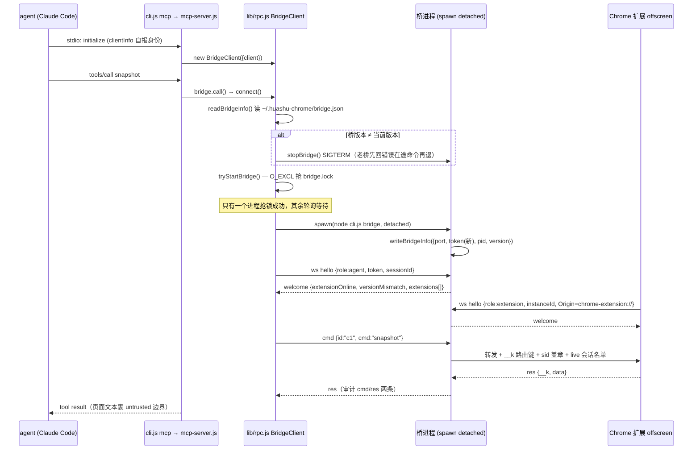

# huashu-chrome 运行机制分析

> 分析日期：2026-09-15 · 版本：v1.2.0 · 入口：`npx huashu-chrome <子命令>`（`src/cli.js`）

## 1. 启动链：从 agent 到桥的自举

MCP server 是「一次性的」（每 agent 会话一个进程），桥是「全机单例」。谁负责把桥拉起来？——**第一个需要它的 MCP server**，用文件锁收敛启动权：



关键代码：

- **会话身份**：`sid = client:p<ppid>`（`src/lib/rpc.js:25-29`）。用父进程 pid——同一 Claude Code 窗口里 MCP server 重启不变，不同窗口天然互异。它必须比桥活得久：桥一晚可重启 38 次，若拿桥的连接序号当身份，所有会话的受控标签页会集体丢失并互相撞页。
- **宿主身份**：`--client` 参数只是兜底；真名以 MCP `initialize` 握手里宿主自报的 `clientInfo.name` 为准（`src/lib/host.js`），经 `slugOf` 归一化（`codex-mcp-client → codex`）后查 `src/agents.json` 取显示名。
- **桥的落盘约定**（`src/lib/paths.js`）：`~/.huashu-chrome/`（0700）下 `bridge.json`（0600，token 每次启动轮换）、`bridge.lock`、`audit.jsonl`、`allowlist.json`、`bridge.log`、`learnings/`。

## 2. 桥 daemon 的生命周期（src/bridge.js）

| 机制 | 参数 | 说明 |
|---|---|---|
| 握手超时 | 5s | 连上不说 hello 直接断（4008） |
| 命令超时 | 默认 30s，可被调用方 1s–600s 覆盖 | 慢命令（download/upload/ask/act/wait）由 MCP 侧按参数给预算 |
| 空闲自杀 | 30 分钟无活动 | `IDLE_EXIT_MS`，不留僵尸进程 |
| 扩展静默检测 | 50s 静默先 ping，15s 无回音才 terminate | 防机器睡眠造成的白断（pmset 暗唤醒记录逐条对上过） |
| 断线孤儿宽限 | 15s | 扩展断线时其在途命令不立刻判死——点击可能已生效，立刻报错会诱导重试 = 双击 |
| 等待队列 | 上限 64 条 / 最长 40s | 扩展不在线时命令挂起等它回来（MV3 SW 回收后最长等一个 30s alarm 周期）；**执行途中**掉线的命令绝不排队重发 |
| 优雅退出 | SIGTERM/SIGINT | 先把在途命令回成「桥正在重启，重试一次即可」再退，不让 agent 干等到超时 |
| 端口 | 8899（可试 8900-8903） | EADDRINUSE → exit(3) |

**多实例并存**：`extensions` 是 Set 而非单槽。同一 `instanceId` 重连才顶掉旧连接；不同 Chrome 实例（如 headless 抓取实例）并存。命令路由 `primary()`：有窗口的优先，同档取最近有动静的（`src/bridge.js:84-97`）。

**站点白名单**：`allowlist.json` 存在且 `mode === 'allowlist'` 时，带 `url` 的命令按 hostname 裁决，不在列表 → `SITE_NOT_ALLOWED`（`src/bridge.js:374-392`）。裁决在桥侧，agent 够不着。当前默认未配置 = 全放行。

## 3. 命令的完整旅程（以 click 为例，8 站全程 127.0.0.1）

1. **agent → MCP server**（stdio）：`tools/call click {ref:"e7", snapshotId:"s3"}`
2. **mcp-server.js**：非本地特殊命令（learnings/fetch 翻页/upload/download/screenshot 有本地处理分支）直接 `bridge.call('click', args, {tabId, timeoutMs})`
3. **bridge.js `dispatch()`**：
   - `checkSite` 白名单裁决
   - `pending` 以 `「connId:id」` 记录（含承接实例，断线只失败自己承接的）
   - 审计 `{ev:'cmd', params: redact(参数)}` —— 脱敏按键名递归 + 正文词级
   - 转发给 primary 扩展，附 `__k`（路由键）、`sid`（会话章）、`client/label`（显示名）、`live`（此刻在线的会话名单）
4. **offscreen.js** 收到 ws 消息 → `chrome.runtime.sendMessage` 递给 SW（这条消息本身会唤醒被回收的 SW）
5. **background.js `onMessage`**：`resolveTab`（无显式 tabId 时取本会话的 `agentTab:<sid>` 槽；有主的页面当场拦下给三条出路）→ `driftNote`（受控页漂移检测）→ `perform()`
6. **content.js（L1）**：`doLocate` 按 ref 在 `refMap` 找元素（快照不符 → `STALE_SNAPSHOT`）→ 拍 `baselineOf` 基线 → 合成 click → `settle` 轮询比对效果
7. **效果证据**（`extension/background.js:1638-1666` effectLines）：命中 `expect` 早停；有变化报 `效果：expanded false → true`；**零证据 → 自动升级 L2**（`execL2` 经 cdp.js 发真实 `Input.dispatchMouseEvent`，`isTrusted:true`），敏感目标（提交/支付/删除/发布，正则+DOM 判定）除外
8. **回程**：快照 + 效果行原路返回；若点击开了新标签页，受控槽自动跟过去并报新旧 tabId

## 4. 扩展侧的连接机制（为什么不会掉线）

```
offscreen.html（常驻文档）
 ├─ 启动时向 SW 要身份（extId/version/instanceId）——offscreen 拿不到 chrome.storage
 ├─ 5 个端口并行探测（每个 1.5s 上限），先握上手的留，其余关掉
 ├─ 心跳 ping 15s，必须收到 pong（只发不验 = 没发）
 ├─ 看门狗：45s（三拍）没收到任何东西 → 主动 close 让重连链跑起来
 │   （半开连接 readyState 骗人，只有「收到过对面的东西」可判）
 ├─ 睡眠感知：这一拍离上一拍 >2 周期 = 机器睡过 → 重起算，先 ping 验证再判死
 └─ 握手窗口期到达的消息缓存后补发（在线会话名单晚到 = 多会话隔离失效）

service worker（background.js，会被 Chrome 回收，无所谓）
 ├─ 收到命令被 runtime 消息叫醒（MV3 官方唤醒路径）
 ├─ SW 直连兜底腿：只在 offscreen 建不起来时启用；offscreen 发 'up' 后 SW 断腿
 ├─ 每 30s alarm：自愈 offscreen 文档 / 清理 cdp 孤儿 attach / kick 重连
 └─ 发件箱：两条腿都断时 res 先落 storage.session（60s 有效），连上补发
```

instanceId 存 `storage.local`（`crypto.randomUUID()`），同一 profile 重启不变、`--user-data-dir` 新实例必然不同——这是桥区分「重连」与「新实例」的根据（`extension/background.js:150-171`）。

## 5. 命令分发与会话槽（background.js）

- **HANDLERS 表**：snapshot / navigate / act / click / type / key / fill / select / read_text / wait / query / download / upload / scroll / read / network / fetch / eval / screenshot / tabs / ask / status / __pay_timeout / reload（25 个处理函数，`extension/background.js:1679` 起）
- **NO_SLOT_CMDS**：tabs/download/reload/status 自管槽语义，不走 `resolveTab`
- **会话槽**：`agentTab:<sid>`（storage.local，LRU 32）+ 户口簿 `ownTabs:<sid>`（上限 16）双结构；`liveSids`（storage.session）随每条命令刷新——扩展据此判断「这个 tab 还有主吗」
- **coach 提醒**：BATCHABLE 命令（click/type/select/fill/key/navigate）连发 ≥3 次会收到「用 act」的教练提示；≥2 页走缺省槽时提醒显式带 tabId（10 分钟冷却）

## 6. L1/L2 双脑执行细节

| | L1（content.js） | L2（cdp.js，chrome.debugger） |
|---|---|---|
| 事件 isTrusted | false | **true** |
| 可用性 | 默认，无黄条 | 需 manifest 的 debugger 权限（装时已授）；popup 有软开关 |
| attach 时机 | — | 首次 L2 操作；5s 空闲自动 detach（黄条不常驻） |
| 后台标签页 | 可用 | 需 `Emulation.setFocusEmulationEnabled`，否则第二发点击直接打断调试会话 |
| 输入 | 合成事件 + `setNativeValue`/`applyText` 手工补浏览器默认行为 | `Input.dispatchKeyEvent`/`insertText`——浏览器自己移焦点、插字符，Monaco/CodeMirror 也认 |
| eval | 页面 CSP 管（大站拦） | `Runtime.evaluate`，CSP 管不着，`userGesture:true` 解锁手势 API |
| 截图 | captureVisibleTab 需前台 | 后台可截；默认 60% JPEG，full:true 拿 1:1 PNG |
| 弹窗 | alert 一弹 JS 停摆，L1 卡死 | `Page.javascriptDialogOpening` 接住，可 dismiss/accept |
| 文件 | DataTransfer 伪造 FileList（isTrusted 站会拦） | `DOM.setFileInputFiles`——浏览器自己的路径，传本机绝对路径，**不搬字节** |

**L2 起步站记忆**：页面弹过风控挑战（cloudflare/hcaptcha/geetest 等 iframe 或文案，`extension/risk.js`）→ 记住 origin → 该站此后一律从 L2 起步，避免「L1 生效但攒风控分」的碎局。

## 7. act 剧本机制（批处理核心）

- **形状**：线性 steps + 三个控制块（一层，不嵌套）：`repeat {steps,until,max≤25}`、`if {cond,then,else}`、`assert {cond}`；条件词汇 `{urlContains,selectorExists,textContains,not}` 与 ask 的 until 同一套
- **真源**：`extension/script.js`——校验（validateScript）、预算（flatCount + EXEC_BUDGET=60）、条件人话（condText）三方共用；repeat 子步禁用 ref（页面每轮重渲染必作废，强制 find/selector）
- **执行**（background.js act handler）：每步执行后自动验效果，零效果/失败/撞上提交-支付-删除控件立即停（`allowSensitive:true` 可放行且进审计）；`read` 步可中途带回观察值；最后只回一份快照
- **超时预算同源**：MCP 侧 `cap(flatCount(steps)×8s + 20s)`，扩展侧 EXEC_BUDGET 兜底——两个数字必须同源，否则预算会判死还在老实跑的剧本（`src/mcp-server.js:610-622`）
- **经验剧本**：learnings 笔记里的 ```` ```act ```` 块就是 steps JSON，`{{占位符}}` 填实值直接跑，无任何特权，全走 act 既有的敏感闸与效果核对

## 8. 效果证据与静默失败防御

产品宣言：「工具返回『已点击』不算数，页面真的动了才算。」

- 每个写操作返回效果行：`效果：expanded false → true`；`expect` 参数把「变没变」升级为「变成我要的样子没有」，落空明说
- 零证据时三分支文案：可能是容器/异步副作用/站点忽略，且明示**别原样重试**（`extension/background.js:1638-1666`）
- 只认「变化发生在目标附近」的证据；全局正文长度是最脏的信号（弹幕/懒加载时刻在改）
- 附带收益：有反应早停，不再固定等 400ms（SETTLE_MS=1200 上限）

## 9. 多会话隔离与可见性

- 同一页两个会话都占着：边框变双色斜条纹、并排两枚胶囊（`extension/mark.js`）
- 可见性三件套：彩色标签组（组色=会话色）+ 页内描边/呼吸光标/驾驶舱 + popup 会话列表；**agent 自己的截图看不到任何标记**（截图幕帘），防止它把我们画的光标当页面元素
- 驾驶舱只显示动词和目标，绝不显示输入内容（密码/私信可能印在正被录屏的页面上）
- 已知边界：Claude Code 主 agent 与 subagent 共用一条 MCP 连接（同 sid），会话级隔离在父子间失效——防线是纪律（每条命令显式带 tabId）+ 缺省槽多页时当面提醒（`docs/双脑.md`）

## 10. 安全闸的运行时路径

| 闸 | 位置 | 触发 | 行为 |
|---|---|---|---|
| Origin 校验 | 桥 verifyClient | 网页连桥 | 当场 403 + `reject_origin` 审计 |
| token 校验 | 桥 handleHello | agent 无 token/错 token | close 4001 + `reject_token` 审计 |
| 站点白名单 | 桥 checkSite | allowlist 模式下 url 不在列表 | `SITE_NOT_ALLOWED` |
| 敏感目标不升级 | background/content isSensitive | 零证据 + 目标是提交/支付/删除/发布 | 明说让 agent 显式 `real:true`；act 撞上即停 |
| 支付确认卡 | background confirmPay + mark.js | 按钮语义=花钱（或「确认」旁有金额，moneyNear） | 浏览器内确认卡 + 切前台 + 桌面通知；无人应答=拒绝；**agent 侧无跳过参数** |
| eval 支付拦截 | content armPayGuard | eval 求值期间的合成点击打在支付按钮 | 捕获阶段就地拦下 |
| 凭据隐去 | redact.js 三层 | read_text 返回前 / 审计落盘前 / ask prompt | URL 层加告诫、成组高熵行替换、正文词级挖凭据/手机号 |
| 页面内容降权 | mcp-server wrapUntrusted | 所有页面文本回 agent | `<page-content untrusted>` 边界 |
| 漂移警告 | background driftNote | 受控页被用户/站点导航走 | 回执最前面显著提示 |

## 11. 经验回流与 learnings 工具

- **读**：`learnings {domain}` → 归一化（去协议头/端口/www、逐级去子域、ALIAS 归并 tmall→taobao 等）→ 出厂 + 本机两层拼接，带「经验是提示不是规则」提示与剧本计数（`src/lib/learnings.js:102-131`）
- **写**：`learnings {domain, save}` 整文件覆盖本机经验，写前 lintPlaybooks 形状体检（不合格照存但当面说清）
- 纯本地读写，**不经过桥**——但要单独进审计（量「LEARNINGS FIRST 有没有人遵守」）

## 12. MCP server 的本地特殊分支（不落地的命令不走桥）

| 命令 | 本地处理 |
|---|---|
| learnings | 纯本地读写 |
| fetch + pages | MCP 侧循环翻页（页码型/游标型，确定性停机：非 2xx/空体/重复体/空游标/max），落盘 JSONL 或内联至 maxBody |
| upload | 先传**路径**给扩展走 CDP `DOM.setFileInputFiles`（浏览器自己读盘，桥不搬字节）；仅拖放且页面无 file input 时才读文件 base64（>48MB 明确报错） |
| download | 扩展走浏览器原生下载到 Downloads，MCP 侧再 `rename` 到 savePath |
| screenshot / binary fetch | base64 不进上下文：savePath 落盘只报路径 |

超时预算公式见 `src/mcp-server.js:610-626`：download 150s；wait = 参数+15s；act = flatCount×8s+20s；ask = 参数+20s；全部 clamp 到 [35s, 600s]。

## 13. 诊断与观测

- `doctor`：配置目录 → 桥（没跑先拉一个再探，防假绿）→ 握手/扩展在线/版本错位/多实例列表 → 扩展文件 → bridge.log 最近断连时刻 → **经验库里记的产品 bug**（正则扫「不生效|无效|bug…」）
- `audit -n`：逐条看命令；`audit --stats`：真实 agent 用法统计——命令分布、回合空档（≈模型回合）中位/p90、act 占写操作比、相邻二元组 Top10（连着出现=前一个没回答问题）、错误 Top8、回执体积
- 版本三元对齐：package.json 是唯一真源（`src/lib/version.js`），桥/扩展/MCP 三处比对，错位在 badge「!」、doctor、回执尾注三处露出
